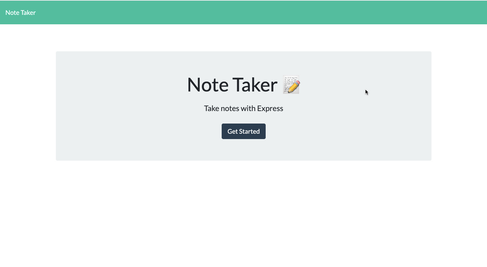
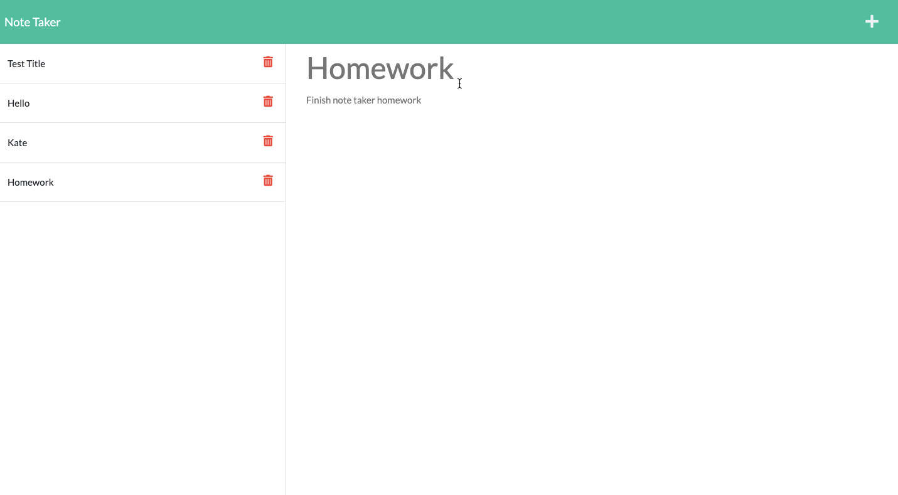

# HOMEWORK 11: Note-taker

The goal of this week's homework was to complete the back-end functionality of a note-taker application using Node.js, Express.js, various npm packages, and then deploy the application live on Heroku. I had to create API routes that return HTML files and that also save and retrieve data from a a JSON file. 

# USER STORY:

AS A small business owner
I WANT to be able to write and save notes
SO THAT I can organize my thoughts and keep track of tasks I need to complete

